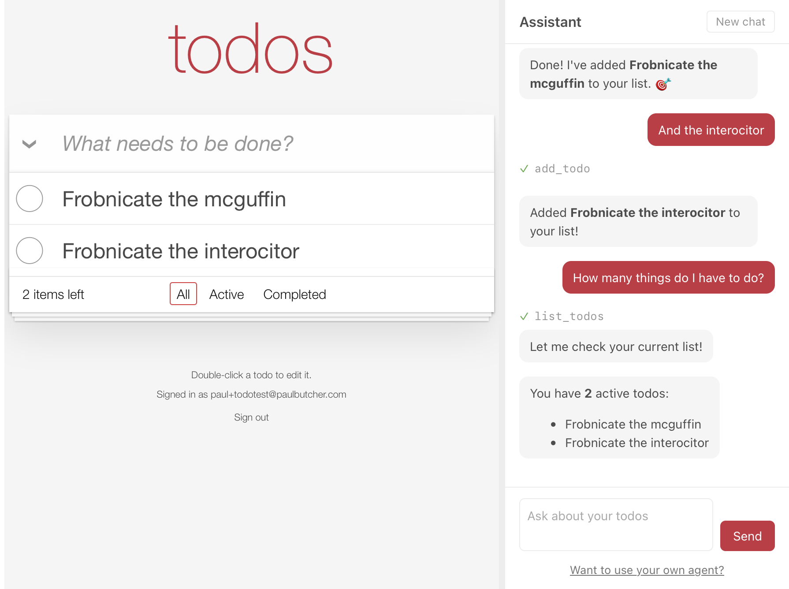

# TodoMVC Max

[TodoMVC](https://todomvc.com) in Lean 4, plus everything a production application needs around it:
passwordless sign-in, SQL migrations, telemetry, an LLM assistant panel via Bedrock, and IaC
deployment to AWS Lambda.

The UI is HTMX plus a very little JavaScript.



## Why Lean?

Lean is a strongly typed functional language with a built-in theorem prover. This allows us to 
make some very strong guarantees, including:

- **Totality.** Nothing in this application is `partial` and nothing in it can panic,
  and the same holds of every library in the table below. A loop that reads until its input runs out
  carries a bound and a proof that it decreases. `warningAsError` is on, so no unfinished proofs.
- **Security properties are theorems.** A page carries its anti-forgery attribute exactly when it
  has a token to put in it (`csrfAttrs_nonempty_iff`): never announcing one it lacks, never dropping
  one it has. A sign-in refusal is proved to speak only about the request and never about who owns
  the address (`onlySpeaksAboutTheRequest`), stated over the whole outcome type.
- **Markup is typed and formally verified.** A `<div>` inside a `<p>` is a type error, text
  content is escaped on the way in, and `Node.render_wellFormed` proves that what comes out is
  well-formed HTML.
- **Routes are strongly typed.** A handler of the wrong arity or the wrong
  type does not compile, and a link cannot drift from the route that serves it.
- **Markdown is formally verified.** lean-markdown is total, never panicking or looping on any
  input including adversarial input. `renderHtmlSafe` is proved to emit well-formed HTML in
  which no string from the document can produce markup or break out of an attribute.
- **Encodings are proved to round-trip.** What is written to a chat row is what is read
  back from it (`toMsg_ofMsg`), which matters because the conversation is replayed to the model in
  full on every turn. Underneath, leancrypto proves `decode (encode bytes) = some bytes` for hex,
  base64, base64url and Crockford base32, that its modular exponentiation agrees with
  `base ^ exponent % modulus`, and that its early-exit-free comparison is equality.

## The stack

Lean, `Std.Http.Server`, and:

| | |
|---|---|
| [lean-html](https://github.com/paulbutcher/lean-html) · [lean-htmx](https://github.com/paulbutcher/lean-htmx) | typed markup and typed `hx-*` attributes |
| [lean-routing](https://github.com/paulbutcher/lean-routing) | typed router and route table |
| [lean-middleware](https://github.com/paulbutcher/lean-middleware) | sessions, sealed cookie store, anti-forgery, static files, request tracing |
| [lean-authentication](https://github.com/paulbutcher/lean-authentication) | magic links, sessions, rate limiting, bounce handling, consent |
| [leanpostgres](https://github.com/paulbutcher/leanpostgres) · [leanmigrate](https://github.com/paulbutcher/leanmigrate) | `libpq` bindings with a connection pool; migrations as plain SQL files |
| [lean-telemetry](https://github.com/paulbutcher/lean-telemetry) | OpenTelemetry traces and logs |
| [lean-llmclient](https://github.com/paulbutcher/lean-llmclient) · [lean-markdown](https://github.com/paulbutcher/lean-markdown) | provider-agnostic chat with tool calling; GFM for rendering replies |
| [lean-aws](https://github.com/paulbutcher/lean-aws) · [lean-aws-lambda](https://github.com/paulbutcher/lean-aws-lambda) | SigV4 signing; the Lambda runtime interface |
| [lean-json](https://github.com/paulbutcher/lean-json) | JSON (see below) |
| [leancurl](https://github.com/paulbutcher/leancurl) | `libcurl` bindings |
| [leancrypto](https://github.com/paulbutcher/leancrypto) | SHA-256, HMAC-SHA256, RSA verification, codecs, DER |

## Why lean-json

Everything above reads and writes JSON with `lean-json` rather than with `Lean.Data.Json`.

The deployed binary is ~12 MB; `Lean.Data.Json` is part of the compiler frontend and linking 
that frontend would increase the binary size by ~125MB, increasing cold start times from the
current ~2 seconds to ~15 seconds.

`lean-json` provides some stronger guarantees than `Lean.Data.Json`: nothing in it is
`partial`, nothing can panic, it is proved correct against the grammar of RFC 8259, and no
operation walks a value on the C stack, so a deeply nested document is a bounded error rather
than a crash. Codecs, paths, `deriving ToJson, FromJson` and `json%` literals are all there;
see its [README](https://github.com/paulbutcher/lean-json#readme).

## Building and running

Needs a Postgres, `libpq` and `libcurl` development packages, and the toolchain in
[lean-toolchain](lean-toolchain). [.devcontainer](.devcontainer/) has all of it.

```
lake build
lake exe TodoMVC        # http://localhost:8080
lake test               # uses the same database
```

`libpq` reads the connection from the usual `PG*` variables, and the role and database they name
have to exist before the first run. [.devcontainer](.devcontainer/) sets them to `leantodomvc`;
outside it, either export your own or create what the devcontainer expects:

```
createuser leantodomvc
createdb -O leantodomvc leantodomvc
export PGHOST=localhost PGUSER=leantodomvc PGDATABASE=leantodomvc
```

Migrations run at startup, so the database itself needs nothing in it; `lake exe migrate` applies
and rolls them back by hand. Sign-in mail is printed to the terminal rather than sent, so following
a magic link needs no mail server, and spans are printed there too in a readable form.

For the assistant panel, anything that puts credentials in the environment will do:

```
eval "$(aws configure export-credentials --profile <profile> --format env)"
export AWS_REGION=<region>
export BEDROCK_MODEL=<model-or-inference-profile-id>
```

## Bringing your own agent

An agent of your own can reach the same tools the panel has, over
[MCP](https://modelcontextprotocol.io) at `/mcp`. There is nothing to configure: point the agent
at the endpoint and it will find its own way in.

Nobody has to know that to use it. "Want to use your own agent?" under the assistant panel leads
to `/connect`, which carries a prompt to paste into an assistant of your own. It tells that
assistant to look up its own current documentation rather than go by what it remembers, since a
model's picture of its own settings is as old as its training data; to say so plainly if it cannot
reach an MCP server at all, rather than invent a menu; and to call `list_todos` once it is done,
so that both sides know it worked. Nothing on the page is secret, which is what having done OAuth
rather than a shared token buys: the thing being pasted into somebody else's chat window is a
public address.

What it follows is the discovery chain the MCP authorization specification defines. A request
carrying no token is refused with a `WWW-Authenticate` naming
`/.well-known/oauth-protected-resource`; that document names this server as the one that issues
tokens for the endpoint; and `/.well-known/oauth-authorization-server` describes the endpoints an
agent needs. An agent that has no client identifier registers itself at `/oauth/register`.

Signing in happens in your browser, once: the agent sends you to `/oauth/authorize`, and you are
shown who is asking, the address your answer will be sent to, and what it wants to do. Two scopes
are on offer and they are separate checkboxes, so an agent that asked for both can be given one:

| Scope | What it reaches |
| --- | --- |
| `todos:read` | `list_todos` |
| `todos:write` | `add_todo`, `edit_todo`, `delete_todo`, `set_done` |

A token reaches only the tools its scopes name, and only your list. An agent holding a read-only
token is not shown the tools it cannot use, so it plans around what it has rather than being
turned away mid-task.

One thing to know. Client identifiers that are URLs
([CIMD](https://modelcontextprotocol.io/specification/2026-07-28/basic/authorization)) are
refused, because nothing here fetches them; agents that register dynamically are unaffected, and
most do.

## Deploying

[template.yaml](template.yaml) defines an AWS [SAM](https://aws.amazon.com/serverless/sam/)
deployment: a VPC with no egress, an RDS Postgres, the function behind a public function URL,
interface endpoints for SES and Bedrock, secrets, a log group, a dashboard and its saved
queries.

You need AWS credentials, a Docker that can build `linux/arm64`, and an SES identity for the
address you will send from. Give its domain SPF, DKIM, DMARC and an MX record, and while the
account is in the SES sandbox, verify the recipients too.

Install the SAM CLI from the [first-party
installer](https://docs.aws.amazon.com/serverless-application-model/latest/developerguide/install-sam-cli.html)
rather than from Homebrew, which is what [.devcontainer](.devcontainer/) does.

```
sam build
sam deploy --guided --stack-name todomvc
```

Answer yes to "Allow SAM CLI IAM role creation" and "Function Function Url has no 
authentication. Is this okay?". `MailFrom` is the only parameter without a default.

A sign-in link has to name an origin, and the function URL is not knowable until the function
exists, so deploy a second time with `BaseUrl` set to what the first deploy printed (either
run `sam deploy --guided` a second time or edit the created `samconfig.toml`).

For the assistant, set `BedrockModel` to an id enabled in your region. Most current models are
reachable only through a cross-region inference profile, which `aws bedrock list-inference-profiles`
lists. A Marketplace-served model enables itself on first invocation, and that invocation must come
from a principal holding `aws-marketplace:Subscribe`, so prime it once from an administrative
identity:

```
aws bedrock-runtime converse --region <region> --model-id "<id>" \
  --messages '[{"role":"user","content":[{"text":"hello"}]}]'
```
**Troubleshooting**

The Homebrew
formula builds against Homebrew's Python, whose `pyexpat` can be linked against a newer `libexpat`
than macOS ships; the import that fails takes the `build` subcommand down with it, and what you see
is `Error: No such command 'build'` rather than anything about the loader.

You may find that you need to set `DOCKER_HOST` if `sam` reports no container runtime:

```
export DOCKER_HOST="unix://$HOME/.docker/run/docker.sock"
```

## Telemetry

Spans and log records leave as one flat JSON object per line on stdout, which the runtime
forwards to CloudWatch Logs.

`lake exe logs` renders those rows back into the form the local server prints directly:

```
sam logs --stack-name todomvc --tail | lake exe logs
```

The local server prints that readable form already, so there is nothing to render; to produce the
flat rows here too, and so to exercise the same path without deploying, ask the console exporter
for them:

```
OTEL_EXPORTER_CONSOLE_FORMAT=flat_json lake exe TodoMVC | lake exe logs
```

The `Dashboard` stack output is a console URL for the dashboard the template creates: platform
metrics, server latency, p99 by route, slowest requests, and errors. Beside it, under Logs Insights,
the template saves the steps of an analysis loop as query definitions, from slowest routes down to a
single trace read end to end.

## License

Copyright (c) 2026 Paul Butcher. Apache 2.0; see [LICENSE](LICENSE).
